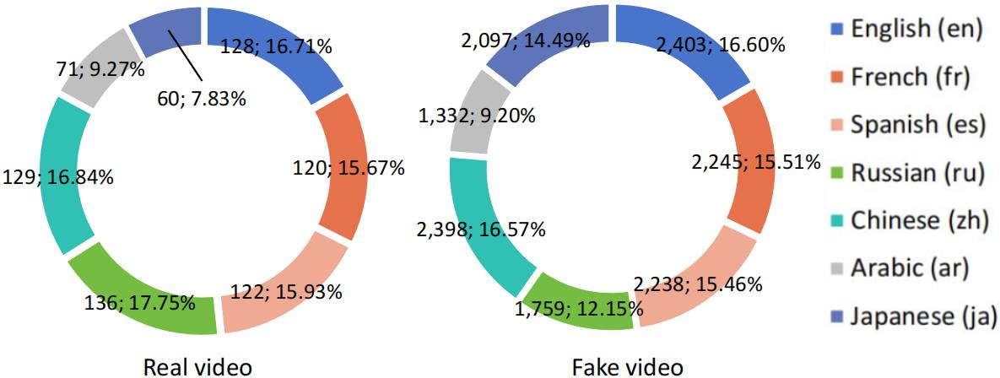
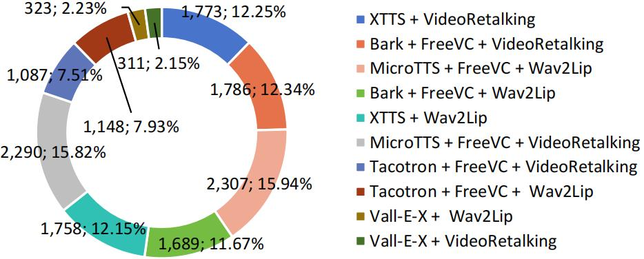
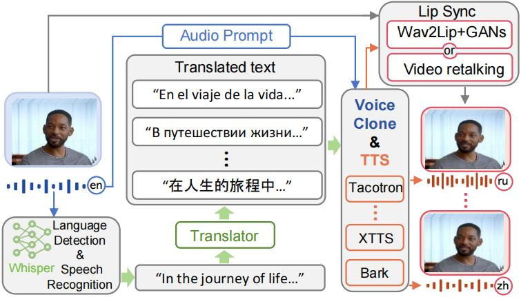
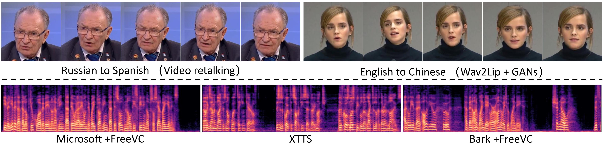

# PolyGlotFake Dataset

## Overview
PolyGlotFake is a novel multilingual and multimodal deepfake dataset meticulously designed to address the challenges and demands of deepfake detection technologies. It consists of videos with manipulated audio and visual components across seven languages, employing advanced Text-to-Speech, voice cloning, and lip-sync technologies. 

## Download DataSet
Please fill out this form to request access to the PolyGlotFake Dataset. We will review your request and respond as soon as possible.

- Please download from this link: https://drive.google.com/file/d/1aBWLii-TbrpKNLSTwpmjqu98eKovWLxF/view?usp=drive_link

## Quantitative Comparison 

| DataSet          | Release Data | Manipulated Modality | Multilingual | Real video | Fake video | Total video | Manipulation Methods | Techniques Labeling | Attribute Labeling |
|------------------|--------------|----------------------|--------------|------------|------------|-------------|---------------------|---------------------|--------------------|
| UADFV            | 2018         | V                    | No           | 49         | 49         | 98          | 1                   | No                  | No                 |
| TIMI             | 2018         | V                    | No           | 320        | 640        | 960         | 2                   | No                  | No                 |
| FF++             | 2019         | V                    | No           | 1,000      | 4,000      | 5,000       | 4                   | No                  | No                 |
| DFD              | 2019         | V                    | No           | 360        | 3,068      | 3,431       | 5                   | No                  | No                 |
| DFDC             | 2020         | A/V                  | No           | 23,654     | 104,500    | 128,154     | 8                   | No                  | No                 |
| DeeperForensics  | 2020         | V                    | No           | 50,000     | 10,000     | 60,000      | 1                   | No                  | No                 |
| Celeb-DF         | 2020         | V                    | No           | 590        | 5,639      | 6,229       | 1                   | No                  | No                 |
| FFIW             | 2020         | V                    | No           | 10,000     | 10,000     | 20,000      | 1                   | No                  | No                 |
| KoDF             | 2021         | V                    | No           | 62,166     | 175,776    | 237,942     | 5                   | No                  | No                 |
| FakeAVCeleb      | 2021         | A/V                  | No           | 500        | 19,500     | 20,000      | 4                   | No                  | Yes                |
| DF-Platter       | 2023         | V                    | No           | 133,260    | 132,496    | 265,756     | 3                   | No                  | Yes                |
| **PolyGlotFake** | **2023**     | **A/V**              | **Yes**      | **766**    | **14,472** | **15,238**  | **10**              | **Yes**             | **Yes**            |


## Dataset Details
### Composition
- **Total Videos**: 15,238
  - **Real Videos**: 766
  - **Fake Videos**: 14,472
- **Resolution**: 1280x720
- **Average Video Duration**: 11.79 seconds

### Languages and Synthesis Methods Distribution
- Language: English; French; Spanish; Russian; Chinese; Arabic; Japanese
- Synthesis methods:
  Audio manipulation: Bark+FreeVC; MicroTTS+FreeVC; XTTS; Tacotron+FreeVC; Vall-E-X
  Video manipulation: VideoRetalking; Wav2Lip

<p float="left">
  
   
</p>

## Generation Pipeline


## Deepfake Detection Benchmark
### Evaluation Results and Comparisons

| Type      | Detector         | Backbone      | FakeAVCeleb | DFDC   | PolyGlotFake |
|-----------|------------------|---------------|-------------|--------|--------------|
| Naive     | MesoNet          | Designed      | 0.7332      | 0.5906 | 0.5672       |
| Naive     | MesoInception    | Designed      | 0.7945      | 0.6344 | 0.5831       |
| Naive     | Xception         | Xception      | 0.9169      | 0.6530 | 0.6052       |
| Naive     | EfficienNet-B4   | EfficienNet   | 0.9023      | 0.6020 | 0.5769       |
| Spatial   | Capsule          | Capsule       | 0.8663      | 0.6146 | 0.6068       |
| Spatial   | FFD              | Xception      | 0.9285      | 0.6583 | 0.5960       |
| Spatial   | CORE             | Xception      | 0.9345      | 0.6625 | 0.6220       |
| Spatial   | RECCE            | Designed      | 0.9396      | 0.6884 | 0.6596       |
| Spatial   | DSP-FWA          | Xception      | 0.9115      | 0.6929 | 0.6658       |
| Frequency | F3Net            | Xception      | 0.9416      | 0.6452 | 0.6439       |
| Frequency | SRM              | Xception      | 0.9043      | 0.6346 | 0.6143       |
| Ensemble  | XRes             | Designed      | 0.9556      | 0.7042 | 0.6835       |


## Visualization


## Ethics Statement
Access to the dataset is restricted to academic institutions and is intended solely for research use. It complies with YouTube's fair use policy through its transformative, non-commercial use, by including only brief excerpts (approximately 20 seconds) from each YouTube video, and ensuring that these excerpts do not adversely affect the copyright owners' ability to earn revenue from their original content. Should any copyright owner feel their rights have been infringed, we are committed to promptly removing the contested material from our dataset.

## Citation

```bibtex
@misc{hou2024polyglotfake,
      title={PolyGlotFake: A Novel Multilingual and Multimodal DeepFake Dataset}, 
      author={Yang Hou and Haitao Fu and Chuankai Chen and Zida Li and Haoyu Zhang and Jianjun Zhao},
      year={2024},
      eprint={2405.08838},
      archivePrefix={arXiv},
      primaryClass={cs.SD}
}
