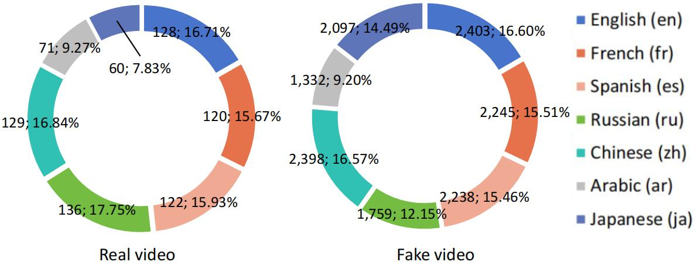
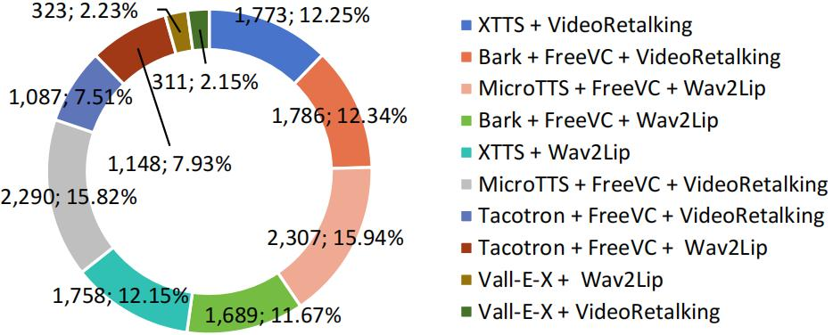
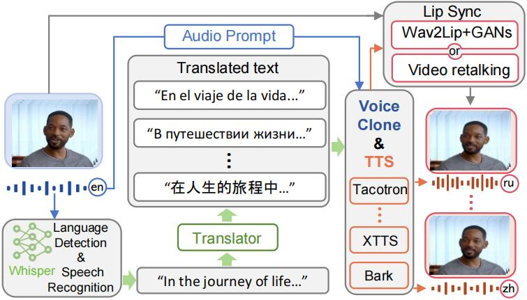
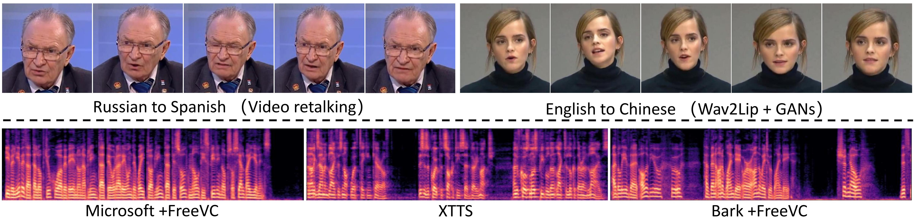

# PolyGlotFake Dataset

## Overview
PolyGlotFake is a novel multilingual and multimodal deepfake dataset meticulously designed to address the challenges and demands of deepfake detection technologies. It consists of videos with manipulated audio and visual components across seven languages, employing advanced Text-to-Speech, voice cloning, and lip-sync technologies. 

### Quantitative Comparison of PolyGlotFake with Existing Publicly Available Video Deepfake Datasets

| DataSet          | Release Data | Manipulated Modality | Multilingual | Real video | Fake video | Total video | Manipulation Methods | Techniques Labeling | Attribute Labeling |
|------------------|--------------|----------------------|--------------|------------|------------|-------------|---------------------|---------------------|--------------------|
| UADFV            | 2018         | V                    | No           | 49         | 49         | 98          | 1                   | No                  | No                 |
| TIMI             | 2018         | V                    | No           | 320        | 640        | 960         | 2                   | No                  | No                 |
| FF++             | 2019         | V                    | No           | 1,000      | 4,000      | 5,000       | 4                   | No                  | No                 |
| DFD              | 2019         | V                    | No           | 360        | 3,068      | 3,431       | 5                   | No                  | No                 |
| DFDC             | 2020         | A/V                  | No           | 23,654     | 104,500    | 128,154     | 8                   | No                  | No                 |
| DeeperForensics  | 2020         | V                    | No           | 50,000     | 10,000     | 60,000      | 1                   | No                  | No                 |
| Celeb-DF         | 2020         | V                    | No           | 590        | 5,639      | 6,229       | 1                   | No                  | No                 |
| FFIW             | 2020         | V                    | No           | 10,000     | 10,000     | 20,000      | 1                   | No                  | No                 |
| KoDF             | 2021         | V                    | No           | 62,166     | 175,776    | 237,942     | 5                   | No                  | No                 |
| FakeAVCeleb      | 2021         | A/V                  | No           | 500        | 19,500     | 20,000      | 4                   | No                  | Yes                |
| DF-Platter       | 2023         | V                    | No           | 133,260    | 132,496    | 265,756     | 3                   | No                  | Yes                |
| **PolyGlotFake** | **2023**     | **A/V**              | **Yes**      | **766**    | **14,472** | **15,238**  | **10**              | **Yes**             | **Yes**            |

## Dataset Details
### Composition
- **Total Videos**: 15,238
  - **Real Videos**: 766
  - **Fake Videos**: 14,472
- **Resolution**: 1280x720
- **Average Video Duration**: 11.79 seconds

### Languages and Synthesis Methods Distribution
- Language: English; French; Spanish; Russian; Chinese; Arabic; Japanese
- Synthesis methods:
  Audio manipulation: Bark+FreeVC; MicroTTS+FreeVC; XTTS; Tacotron+FreeVC; Vall-E-X
  Video manipulation: VideoRetalking; Wav2Lip

  
   

## Generation Pipeline

## Deepfake Detection Benchmark

## Visualization

## Citation
Please cite the following paper if you use the PolyGlotFake dataset in your research:

